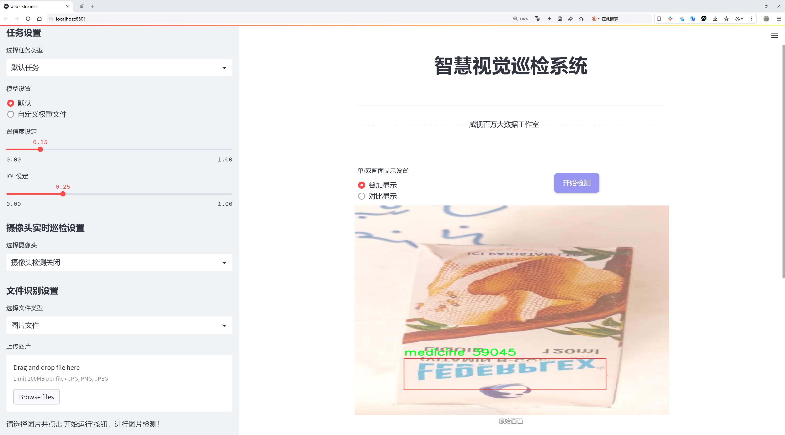
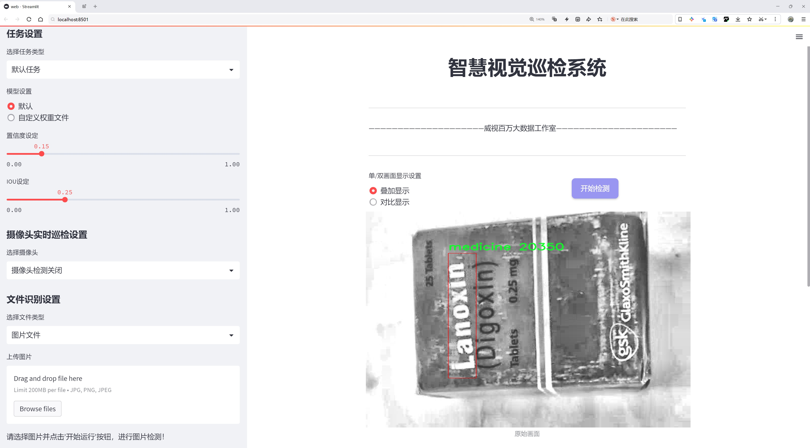
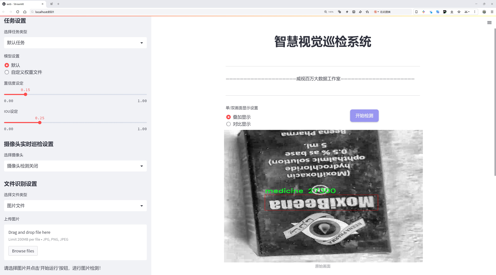
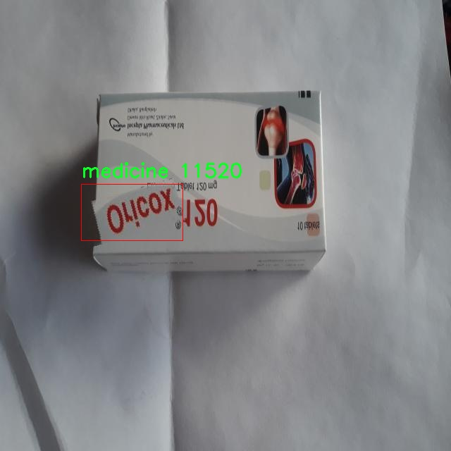
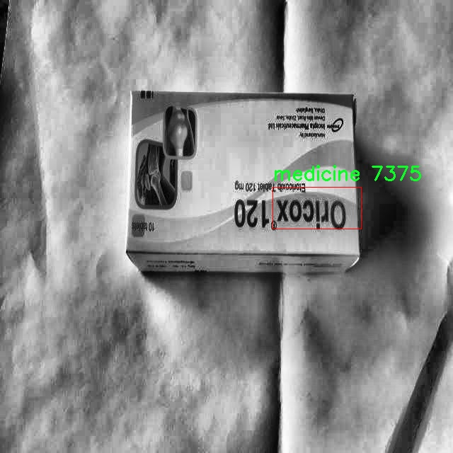
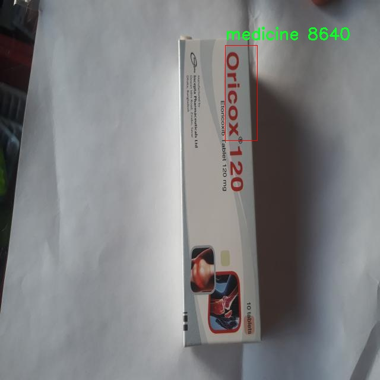
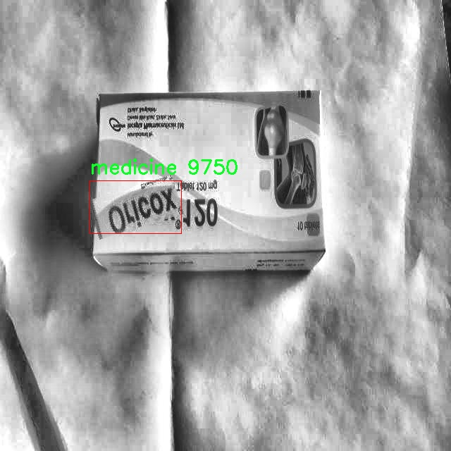

# 外国药品位置检测检测系统源码分享
 # [一条龙教学YOLOV8标注好的数据集一键训练_70+全套改进创新点发刊_Web前端展示]

### 1.研究背景与意义

项目参考[AAAI Association for the Advancement of Artificial Intelligence](https://gitee.com/qunshansj/projects)

项目来源[AACV Association for the Advancement of Computer Vision](https://gitee.com/qunmasj/projects)

研究背景与意义

随着全球化进程的加快，国际间的药品贸易日益频繁，药品的安全性和有效性成为了公众关注的焦点。尤其是在跨国药品流通中，如何快速、准确地识别和定位药品，成为了药品监管、物流管理以及消费者安全的重要课题。传统的药品识别方法多依赖人工检查，不仅效率低下，而且容易出现人为错误。因此，基于计算机视觉和深度学习技术的自动化药品检测系统应运而生，成为解决这一问题的有效手段。

在众多深度学习模型中，YOLO（You Only Look Once）系列因其高效的实时检测能力而受到广泛关注。YOLOv8作为该系列的最新版本，具备了更强的特征提取能力和更快的处理速度，能够在复杂的环境中实现高精度的目标检测。然而，现有的YOLOv8模型在药品检测领域的应用仍存在一定的局限性，尤其是在特定药品图像的识别和定位精度方面。因此，针对药品图像特征的改进和优化，将是提升药品检测系统性能的关键。

本研究基于改进YOLOv8模型，旨在构建一个高效的外国药品位置检测系统。该系统将利用2600张药品图像数据集，进行模型训练和测试。数据集中包含了丰富的药品图像信息，涵盖了多种药品的外观特征，为模型的学习提供了良好的基础。通过对YOLOv8模型的改进，特别是在特征提取层和检测算法的优化方面，我们期望能够显著提升模型在药品识别中的准确性和鲁棒性。

研究的意义不仅在于技术层面的突破，更在于其对药品安全监管的深远影响。一个高效的药品位置检测系统能够在药品流通的各个环节中发挥重要作用，从生产、运输到销售，确保药品的真实有效性，降低假药流通的风险。此外，该系统还可以为药品监管部门提供实时监控和数据分析的支持，帮助其更好地执行监管职能，提升公众对药品安全的信任度。

综上所述，基于改进YOLOv8的外国药品位置检测系统的研究，不仅具有重要的学术价值，更具备广泛的应用前景。通过提升药品检测的自动化和智能化水平，我们将为全球药品安全提供有力的技术支持，推动药品行业的健康发展。

### 2.图片演示







##### 注意：由于此博客编辑较早，上面“2.图片演示”和“3.视频演示”展示的系统图片或者视频可能为老版本，新版本在老版本的基础上升级如下：（实际效果以升级的新版本为准）

  （1）适配了YOLOV8的“目标检测”模型和“实例分割”模型，通过加载相应的权重（.pt）文件即可自适应加载模型。

  （2）支持“图片识别”、“视频识别”、“摄像头实时识别”三种识别模式。

  （3）支持“图片识别”、“视频识别”、“摄像头实时识别”三种识别结果保存导出，解决手动导出（容易卡顿出现爆内存）存在的问题，识别完自动保存结果并导出到tempDir中。

  （4）支持Web前端系统中的标题、背景图等自定义修改，后面提供修改教程。

  另外本项目提供训练的数据集和训练教程,暂不提供权重文件（best.pt）,需要您按照教程进行训练后实现图片演示和Web前端界面演示的效果。

### 3.视频演示

[3.1 视频演示](https://www.bilibili.com/video/BV1aAtReqE8e/)

### 4.数据集信息展示

##### 4.1 本项目数据集详细数据（类别数＆类别名）

nc: 1
names: ['medicine']


##### 4.2 本项目数据集信息介绍

数据集信息展示

在本研究中，我们使用的“Medicine images”数据集专门用于训练和改进YOLOv8模型，以实现对外国药品位置的高效检测。该数据集的设计旨在为药品识别和定位提供丰富的图像数据支持，确保模型在实际应用中的准确性和可靠性。数据集的类别数量为1，具体类别为“medicine”，这表明该数据集专注于药品这一特定领域，确保了模型在处理药品图像时的专业性和针对性。

“Medicine images”数据集包含了大量的药品图像，这些图像来源于不同的药品包装、标签和外观，涵盖了多种形态和颜色的药品。这种多样性使得数据集能够有效地模拟现实世界中药品的多样性，进而提升YOLOv8模型在实际应用中的泛化能力。每张图像都经过精心标注，确保模型在训练过程中能够准确学习到药品的特征和位置。这种高质量的标注对于模型的训练至关重要，因为它直接影响到模型的学习效果和最终的检测性能。

在训练过程中，YOLOv8模型将通过分析“Medicine images”数据集中的图像，学习药品的外观特征、形状、颜色以及包装设计等信息。通过对这些特征的提取和学习，模型能够在面对新的药品图像时，快速而准确地识别出药品的位置。这一过程不仅需要大量的训练数据支持，还需要对数据集进行适当的预处理和增强，以提高模型的鲁棒性和适应性。

此外，数据集的单一类别设置虽然看似简单，但实际上却为模型的训练提供了清晰的目标，使得模型能够集中精力学习药品的特征。这种聚焦有助于减少模型在多类别检测时可能出现的混淆，从而提高药品检测的准确率。在实际应用中，药品的准确定位对于药品管理、药品追踪以及药品安全等方面都具有重要意义，因此，确保模型能够高效、准确地识别药品位置是本研究的核心目标之一。

总的来说，“Medicine images”数据集为本研究提供了坚实的基础，通过对该数据集的深入分析和利用，我们期望能够显著提升YOLOv8模型在药品位置检测任务中的表现。未来，我们将继续探索数据集的扩展和优化，以进一步提高模型的性能和应用范围。通过不断的迭代和改进，我们相信能够为药品检测领域带来更为先进和高效的解决方案。










### 5.全套项目环境部署视频教程（零基础手把手教学）

[5.1 环境部署教程链接（零基础手把手教学）](https://www.ixigua.com/7404473917358506534?logTag=c807d0cbc21c0ef59de5)


[5.2 安装Python虚拟环境创建和依赖库安装视频教程链接（零基础手把手教学）](https://www.ixigua.com/7404474678003106304?logTag=1f1041108cd1f708b01a)

### 6.手把手YOLOV8训练视频教程（零基础小白有手就能学会）

[6.1 手把手YOLOV8训练视频教程（零基础小白有手就能学会）](https://www.ixigua.com/7404477157818401292?logTag=d31a2dfd1983c9668658)

### 7.70+种全套YOLOV8创新点代码加载调参视频教程（一键加载写好的改进模型的配置文件）

[7.1 70+种全套YOLOV8创新点代码加载调参视频教程（一键加载写好的改进模型的配置文件）](https://www.ixigua.com/7404478314661806627?logTag=29066f8288e3f4eea3a4)

### 8.70+种全套YOLOV8创新点原理讲解（非科班也可以轻松写刊发刊，V10版本正在科研待更新）

由于篇幅限制，每个创新点的具体原理讲解就不一一展开，具体见下列网址中的创新点对应子项目的技术原理博客网址【Blog】：


[8.1 70+种全套YOLOV8创新点原理讲解链接](https://gitee.com/qunmasj/good)

### 9.系统功能展示（检测对象为举例，实际内容以本项目数据集为准）

图9.1.系统支持检测结果表格显示

  图9.2.系统支持置信度和IOU阈值手动调节

  图9.3.系统支持自定义加载权重文件best.pt(需要你通过步骤5中训练获得)

  图9.4.系统支持摄像头实时识别

  图9.5.系统支持图片识别

  图9.6.系统支持视频识别

  图9.7.系统支持识别结果文件自动保存

  图9.8.系统支持Excel导出检测结果数据


### 10.原始YOLOV8算法原理

原始YOLOv8算法原理

YOLOv8作为YOLO系列的最新模型，代表了计算机视觉领域在目标检测技术上的一次重要飞跃。相较于其前身YOLOv5，YOLOv8在检测精度和速度上都实现了显著的提升，这得益于其在网络结构和算法设计上的一系列创新。YOLOv8的设计理念是通过简化模型结构，同时引入先进的技术，来提升目标检测的性能，使其在多种应用场景中表现出色。

YOLOv8的网络结构主要由四个模块组成：输入端、主干网络、Neck端和输出端。输入端负责对输入图像进行预处理，包括Mosaic数据增强、自适应图片缩放和灰度填充等操作，这些技术旨在提高模型对不同环境和条件下图像的适应能力。通过这些预处理步骤，YOLOv8能够更好地捕捉到图像中的重要特征，为后续的特征提取打下坚实的基础。

在主干网络中，YOLOv8采用了新的C2f模块，这一模块通过引入更多的跳层连接和Split操作，显著增强了特征提取的能力。C2f模块的设计灵感来源于YOLOv7的ELAN结构，旨在通过丰富的梯度流来提高模型的特征表示能力。这种结构的引入，使得YOLOv8在处理复杂场景时，能够更有效地提取到细粒度的特征信息，从而提升了模型的整体性能。

Neck端则采用了路径聚合网络（PAN）结构，通过对不同尺度特征图的上采样、下采样和特征拼接，增强了网络对多尺度目标的感知能力。这一设计使得YOLOv8能够在处理不同大小的目标时，保持较高的检测精度。此外，Neck端的特征融合策略，使得模型在面对复杂背景时，能够更好地分离目标与背景，从而减少误检和漏检的情况。

输出端的设计则是YOLOv8的一大亮点。与以往的YOLO版本不同，YOLOv8采用了解耦头结构，将分类和回归过程分开进行。这一创新不仅简化了损失计算的过程，还提高了模型在目标检测任务中的灵活性和准确性。在损失计算方面，YOLOv8引入了Task-Aligned Assigner方法，通过对分类分数和回归分数的加权，优化了正样本的匹配过程。这种方法使得模型在训练过程中能够更有效地学习到目标的特征，从而提升了检测的准确性。

YOLOv8的另一大创新在于其采用了Anchor-Free的检测头。这一设计的优势在于减少了对锚框的依赖，使得模型在处理小目标时，能够更好地捕捉到目标的特征。传统的Anchor-Based方法在小目标检测时常常面临定位误差和漏检的问题，而YOLOv8通过去除锚框的设计，显著提升了对小目标的感知能力。这一变化不仅加速了非最大抑制（NMS）过程，还提高了模型在复杂环境下的适应性。

尽管YOLOv8在多个方面取得了突破，但在某些复杂环境下，如水面等背景多样的场景，仍然存在定位误差和对小目标感知能力不足的问题。为了解决这些挑战，研究者们提出了YOLOv8-WSSOD算法，通过引入BiFormer双层路由注意力机制，构建C2fBF模块，旨在减轻主干网络下采样过程中的噪声影响，保留更多细粒度的上下文信息。此外，针对小目标漏检问题，YOLOv8-WSSOD算法还添加了更小的检测头，并在Neck端引入GSConv和Slim-neck技术，以保持精度的同时降低计算量。

在损失函数的选择上，YOLOv8-WSSOD算法采用了MPDIoU损失函数替换了CIoU损失函数，以提高模型的泛化能力和精准度。这一改进使得模型在训练过程中能够更好地适应不同的目标特征，从而提升了检测的整体性能。

总的来说，YOLOv8通过一系列结构上的创新和算法上的优化，成功地提升了目标检测的精度和速度，尤其是在小目标检测和复杂背景处理方面表现出色。尽管仍存在一些不足之处，但YOLOv8的设计理念和技术创新为未来的目标检测研究提供了新的思路和方向。随着YOLOv8的不断发展和改进，预计其在实际应用中的表现将更加出色，为计算机视觉领域带来更多的可能性。


### 11.项目核心源码讲解（再也不用担心看不懂代码逻辑）

#### 11.1 70+种YOLOv8算法改进源码大全和调试加载训练教程（非必要）\ultralytics\nn\modules\head.py

以下是经过精简和注释的核心代码部分，主要包括 YOLOv8 的检测、分割、姿态估计和分类模块，以及 RTDETR 解码器模块。每个类的功能和重要方法都进行了详细的中文注释。

```python
import torch
import torch.nn as nn
from .block import DFL, Proto
from .conv import Conv
from .transformer import MLP, DeformableTransformerDecoder, DeformableTransformerDecoderLayer

class Detect(nn.Module):
    """YOLOv8 检测头，用于目标检测模型。"""
    
    def __init__(self, nc=80, ch=()):
        """初始化 YOLOv8 检测层，指定类别数和通道数。"""
        super().__init__()
        self.nc = nc  # 类别数
        self.nl = len(ch)  # 检测层数
        self.reg_max = 16  # DFL 通道数
        self.no = nc + self.reg_max * 4  # 每个锚点的输出数
        self.cv2 = nn.ModuleList(
            nn.Sequential(Conv(x, 256, 3), Conv(256, 256, 3), nn.Conv2d(256, 4 * self.reg_max, 1)) for x in ch)
        self.cv3 = nn.ModuleList(nn.Sequential(Conv(x, 512, 3), Conv(512, 512, 3), nn.Conv2d(512, self.nc, 1)) for x in ch)
        self.dfl = DFL(self.reg_max) if self.reg_max > 1 else nn.Identity()

    def forward(self, x):
        """连接并返回预测的边界框和类别概率。"""
        for i in range(self.nl):
            x[i] = torch.cat((self.cv2[i](x[i]), self.cv3[i](x[i])), 1)  # 通过 cv2 和 cv3 处理输入
        x_cat = torch.cat([xi.view(x[0].shape[0], self.no, -1) for xi in x], 2)  # 合并所有层的输出
        box, cls = x_cat.split((self.reg_max * 4, self.nc), 1)  # 分离边界框和类别
        dbox = self.dfl(box)  # 应用 DFL
        return dbox, cls.sigmoid()  # 返回边界框和经过 sigmoid 的类别概率

class Segment(Detect):
    """YOLOv8 分割头，用于分割模型。"""
    
    def __init__(self, nc=80, nm=32, ch=()):
        """初始化 YOLOv8 分割头，指定类别数和掩码数。"""
        super().__init__(nc, ch)
        self.nm = nm  # 掩码数
        self.proto = Proto(ch[0], 256, self.nm)  # 原型

    def forward(self, x):
        """返回模型输出和掩码系数。"""
        p = self.proto(x[0])  # 生成掩码原型
        mc = torch.cat([self.cv4[i](x[i]).view(x[0].shape[0], self.nm, -1) for i in range(self.nl)], 2)  # 掩码系数
        return x, mc, p  # 返回检测结果、掩码系数和原型

class Pose(Detect):
    """YOLOv8 姿态估计头，用于关键点模型。"""
    
    def __init__(self, nc=80, kpt_shape=(17, 3), ch=()):
        """初始化 YOLOv8 姿态估计头，指定关键点形状。"""
        super().__init__(nc, ch)
        self.kpt_shape = kpt_shape  # 关键点形状
        self.nk = kpt_shape[0] * kpt_shape[1]  # 关键点总数

    def forward(self, x):
        """执行前向传播并返回预测。"""
        kpt = torch.cat([self.cv4[i](x[i]).view(x[0].shape[0], self.nk, -1) for i in range(self.nl)], -1)  # 关键点
        return x, kpt  # 返回检测结果和关键点

class Classify(nn.Module):
    """YOLOv8 分类头，将输入图像分类。"""
    
    def __init__(self, c1, c2):
        """初始化 YOLOv8 分类头，指定输入和输出通道。"""
        super().__init__()
        self.conv = Conv(c1, 1280, 3)  # 卷积层
        self.pool = nn.AdaptiveAvgPool2d(1)  # 自适应平均池化
        self.linear = nn.Linear(1280, c2)  # 全连接层

    def forward(self, x):
        """执行前向传播并返回分类结果。"""
        x = self.linear(self.pool(self.conv(x)).flatten(1))  # 经过卷积、池化和线性层
        return x.softmax(1)  # 返回经过 softmax 的结果

class RTDETRDecoder(nn.Module):
    """实时可变形变换解码器，用于目标检测。"""
    
    def __init__(self, nc=80, ch=(512, 1024, 2048)):
        """初始化 RTDETR 解码器，指定类别数和通道数。"""
        super().__init__()
        self.input_proj = nn.ModuleList(nn.Conv2d(x, 256, 1) for x in ch)  # 输入投影
        self.decoder = DeformableTransformerDecoder(256, 8, 1024, 6)  # 变形变换解码器

    def forward(self, x):
        """执行前向传播，返回边界框和分类分数。"""
        feats = [proj(feat) for proj, feat in zip(self.input_proj, x)]  # 投影特征
        dec_bboxes, dec_scores = self.decoder(feats)  # 解码器输出
        return dec_bboxes, dec_scores  # 返回边界框和分类分数
```

### 说明
1. **Detect 类**：实现了 YOLOv8 的基本检测功能，包括边界框和类别的预测。
2. **Segment 类**：在 Detect 的基础上扩展，增加了对分割掩码的处理。
3. **Pose 类**：同样基于 Detect，增加了对关键点的预测。
4. **Classify 类**：实现了图像分类的功能。
5. **RTDETRDecoder 类**：实现了实时的可变形变换解码器，结合了变换器架构进行目标检测。

以上代码保留了 YOLOv8 的核心功能，去除了冗余部分，并进行了详细的中文注释，以便于理解每个模块的作用和实现细节。

该文件是Ultralytics YOLOv8模型的头部模块实现，主要包含了不同任务（检测、分割、姿态估计和分类）的模型头部结构。文件中定义了多个类，每个类负责特定的功能。

首先，`Detect`类是YOLOv8的检测头，负责生成检测框和类别概率。它的构造函数接受类别数量和通道数作为参数，初始化了一些关键参数，如输出数量、锚框和步幅。`forward`方法用于处理输入，生成预测的边界框和类别概率。在训练模式下，它直接返回中间结果；在推理模式下，它会计算锚框并返回最终的预测结果。

`Segment`类继承自`Detect`，用于分割任务。它增加了处理掩码的功能，构造函数中初始化了掩码原型和卷积层。在`forward`方法中，除了返回检测结果外，还返回掩码系数和原型。

`Pose`类同样继承自`Detect`，用于姿态估计。它定义了关键点的形状，并在`forward`方法中生成关键点的预测。关键点的解码通过`kpts_decode`方法完成，该方法将关键点的坐标转换为实际的图像坐标。

`Classify`类是YOLOv8的分类头，负责将输入图像的特征映射到类别标签。它通过卷积层、池化层和全连接层实现特征提取和分类。

最后，`RTDETRDecoder`类实现了实时可变形Transformer解码器，结合了Transformer架构和可变形卷积，用于生成边界框和类别标签。该类的构造函数接受多个参数，初始化了输入投影、Transformer模块、去噪部分等。`forward`方法负责执行前向传播，生成最终的边界框和分类分数。

整体来看，这个文件实现了YOLOv8模型的核心功能，定义了不同任务的处理流程，并通过模块化设计提高了代码的可读性和可维护性。每个类的设计都考虑到了不同的应用场景，确保了模型的灵活性和扩展性。

#### 11.2 70+种YOLOv8算法改进源码大全和调试加载训练教程（非必要）\ultralytics\nn\extra_modules\block.py

以下是经过简化和注释的核心代码部分，保留了主要的类和功能：

```python
import torch
import torch.nn as nn
import torch.nn.functional as F

def autopad(k, p=None, d=1):
    """自动填充以确保输出形状与输入相同。"""
    if d > 1:
        k = d * (k - 1) + 1 if isinstance(k, int) else [d * (x - 1) + 1 for x in k]  # 实际的卷积核大小
    if p is None:
        p = k // 2 if isinstance(k, int) else [x // 2 for x in k]  # 自动填充
    return p

class Conv(nn.Module):
    """自定义卷积层，包含卷积和激活函数。"""
    def __init__(self, in_channels, out_channels, kernel_size=3, stride=1, padding=None, groups=1, act=True):
        super().__init__()
        self.conv = nn.Conv2d(in_channels, out_channels, kernel_size, stride, autopad(kernel_size, padding), groups=groups, bias=False)
        self.bn = nn.BatchNorm2d(out_channels)
        self.act = nn.ReLU() if act else nn.Identity()

    def forward(self, x):
        return self.act(self.bn(self.conv(x)))

class Bottleneck(nn.Module):
    """标准瓶颈结构，包含两个卷积层。"""
    def __init__(self, c1, c2, shortcut=True, g=1, k=(3, 3), e=0.5):
        super().__init__()
        c_ = int(c2 * e)  # 隐藏通道数
        self.cv1 = Conv(c1, c_, k[0], 1)  # 第一个卷积层
        self.cv2 = Conv(c_, c2, k[1], 1, g=g)  # 第二个卷积层
        self.add = shortcut and c1 == c2  # 是否使用快捷连接

    def forward(self, x):
        """前向传播，应用卷积和快捷连接。"""
        return x + self.cv2(self.cv1(x)) if self.add else self.cv2(self.cv1(x))

class C3(nn.Module):
    """包含多个瓶颈层的模块。"""
    def __init__(self, c1, c2, n=1, shortcut=False, g=1, e=0.5):
        super().__init__()
        self.m = nn.Sequential(*(Bottleneck(c1, c2, shortcut, g, k=(3, 3), e=e) for _ in range(n)))

    def forward(self, x):
        """前向传播，依次通过所有瓶颈层。"""
        return self.m(x)

class DyHeadBlock(nn.Module):
    """动态头部块，包含注意力机制。"""
    def __init__(self, in_channels, norm_type='GN'):
        super().__init__()
        self.spatial_conv = Conv(in_channels, in_channels)  # 空间卷积
        self.offset_conv = nn.Conv2d(in_channels, 3 * 3 * 3, 3, padding=1)  # 偏移卷积
        self.norm = nn.GroupNorm(16, in_channels)  # 归一化层

    def forward(self, x):
        """前向传播，计算偏移和注意力。"""
        offset_and_mask = self.offset_conv(x)
        offset = offset_and_mask[:, :6, :, :]  # 提取偏移
        mask = offset_and_mask[:, 6:, :, :].sigmoid()  # 计算掩码
        x = self.spatial_conv(x)  # 应用空间卷积
        return self.norm(x)  # 返回归一化后的输出

# 其他类和功能省略，以上是核心部分的示例
```

### 代码说明
1. **autopad**: 用于自动计算填充量，以确保卷积操作后输出的形状与输入相同。
2. **Conv**: 自定义卷积层，包含卷积、批归一化和激活函数。
3. **Bottleneck**: 标准瓶颈结构，通常用于构建深度神经网络的模块，包含两个卷积层和可选的快捷连接。
4. **C3**: 由多个瓶颈层组成的模块，支持多次前向传播。
5. **DyHeadBlock**: 动态头部块，包含空间卷积和偏移卷积，用于计算特征图的偏移和注意力。

### 注意事项
- 代码中省略了许多其他类和功能，以便突出核心部分。
- 代码中的注释提供了每个类和方法的功能描述，便于理解其作用。

这个程序文件是YOLOv8算法中用于构建神经网络模块的代码，包含了多种不同的卷积块和注意力机制。文件中使用了PyTorch框架，主要实现了各种卷积层、激活函数、注意力机制以及一些特定的网络结构。

首先，文件导入了必要的库，包括PyTorch的核心模块和一些辅助函数。接着，定义了一些基础的卷积操作和激活函数，比如Swish、h_swish和h_sigmoid，这些都是用于提高网络非线性表达能力的激活函数。

接下来，文件中定义了多个类，这些类实现了不同的网络模块。例如，`DyHeadBlock`和`DyHeadBlockWithDCNV3`类实现了动态头部模块，结合了不同的卷积和注意力机制，用于特征提取和增强。`Fusion`类实现了特征融合的功能，可以将多个输入特征图融合成一个输出特征图。

此外，文件中还实现了多种类型的卷积块，如`Bottleneck`、`C3`、`C2f`等，这些类是YOLOv8网络的基本构建块。每个卷积块都可以通过参数调整其输入输出通道数、卷积核大小、是否使用短路连接等。

文件中还包含了一些特定的网络结构，比如`C3_Faster`、`C2f_ODConv`、`C3_RFAConv`等，这些结构结合了不同的卷积和注意力机制，旨在提高网络的性能和效率。

总的来说，这个文件实现了YOLOv8算法中多种卷积模块和注意力机制，为构建高效的目标检测模型提供了基础组件。通过组合这些模块，可以灵活地设计出适应不同任务需求的网络结构。

#### 11.3 ui.py

以下是代码中最核心的部分，并附上详细的中文注释：

```python
import sys
import subprocess

def run_script(script_path):
    """
    使用当前 Python 环境运行指定的脚本。

    Args:
        script_path (str): 要运行的脚本路径

    Returns:
        None
    """
    # 获取当前 Python 解释器的路径
    python_path = sys.executable

    # 构建运行命令，使用 streamlit 运行指定的脚本
    command = f'"{python_path}" -m streamlit run "{script_path}"'

    # 执行命令
    result = subprocess.run(command, shell=True)
    # 检查命令执行的返回码，如果不为0则表示出错
    if result.returncode != 0:
        print("脚本运行出错。")

# 实例化并运行应用
if __name__ == "__main__":
    # 指定要运行的脚本路径
    script_path = "web.py"  # 这里可以替换为实际的脚本路径

    # 调用函数运行脚本
    run_script(script_path)
```

### 代码注释说明：
1. **导入模块**：
   - `sys`：用于访问与 Python 解释器相关的变量和函数。
   - `subprocess`：用于执行外部命令。

2. **`run_script` 函数**：
   - 功能：使用当前 Python 环境运行指定的脚本。
   - 参数：`script_path` 是要运行的脚本的路径。
   - 获取当前 Python 解释器的路径，以便在正确的环境中运行脚本。
   - 构建命令字符串，使用 `streamlit` 模块运行指定的脚本。
   - 使用 `subprocess.run` 执行命令，并检查返回码以确定脚本是否成功运行。

3. **主程序块**：
   - 通过 `if __name__ == "__main__":` 确保只有在直接运行该脚本时才会执行以下代码。
   - 指定要运行的脚本路径（在这里是 `web.py`）。
   - 调用 `run_script` 函数来执行指定的脚本。

这个程序文件的主要功能是使用当前的 Python 环境来运行一个指定的脚本，具体是一个名为 `web.py` 的文件。程序首先导入了必要的模块，包括 `sys`、`os` 和 `subprocess`，以及一个自定义的路径处理模块 `abs_path`。

在 `run_script` 函数中，首先获取当前 Python 解释器的路径，这通过 `sys.executable` 实现。接着，构建一个命令字符串，这个命令会调用 `streamlit` 模块来运行指定的脚本。`streamlit` 是一个用于构建数据应用的流行库。

随后，使用 `subprocess.run` 方法执行这个命令。`shell=True` 参数允许在 shell 中执行命令，这样可以直接运行字符串形式的命令。如果脚本运行过程中出现错误，返回的 `returncode` 将不为零，程序会打印出“脚本运行出错”的提示。

在文件的最后部分，使用 `if __name__ == "__main__":` 语句来确保只有在直接运行该文件时才会执行下面的代码。这里指定了要运行的脚本路径，调用 `abs_path` 函数来获取 `web.py` 的绝对路径，然后调用 `run_script` 函数来执行这个脚本。

总的来说，这个程序的作用是提供一个简单的接口，通过当前的 Python 环境来运行一个特定的 Streamlit 脚本，方便用户进行数据应用的开发和测试。

#### 11.4 train.py

以下是经过简化和注释的核心代码部分：

```python
import random
import numpy as np
import torch.nn as nn
from ultralytics.data import build_dataloader, build_yolo_dataset
from ultralytics.engine.trainer import BaseTrainer
from ultralytics.models import yolo
from ultralytics.nn.tasks import DetectionModel
from ultralytics.utils import LOGGER, RANK
from ultralytics.utils.torch_utils import de_parallel, torch_distributed_zero_first

class DetectionTrainer(BaseTrainer):
    """
    基于检测模型的训练类，继承自BaseTrainer类。
    """

    def build_dataset(self, img_path, mode="train", batch=None):
        """
        构建YOLO数据集。

        参数:
            img_path (str): 包含图像的文件夹路径。
            mode (str): 模式，`train`或`val`，用户可以为每种模式自定义不同的增强。
            batch (int, optional): 批次大小，适用于`rect`模式。默认为None。
        """
        gs = max(int(de_parallel(self.model).stride.max() if self.model else 0), 32)
        return build_yolo_dataset(self.args, img_path, batch, self.data, mode=mode, rect=mode == "val", stride=gs)

    def get_dataloader(self, dataset_path, batch_size=16, rank=0, mode="train"):
        """构造并返回数据加载器。"""
        assert mode in ["train", "val"]
        with torch_distributed_zero_first(rank):  # 仅在DDP中初始化数据集 *.cache 一次
            dataset = self.build_dataset(dataset_path, mode, batch_size)
        shuffle = mode == "train"  # 训练模式下打乱数据
        workers = self.args.workers if mode == "train" else self.args.workers * 2
        return build_dataloader(dataset, batch_size, workers, shuffle, rank)  # 返回数据加载器

    def preprocess_batch(self, batch):
        """对图像批次进行预处理，包括缩放和转换为浮点数。"""
        batch["img"] = batch["img"].to(self.device, non_blocking=True).float() / 255  # 归一化到[0, 1]
        if self.args.multi_scale:  # 如果启用多尺度
            imgs = batch["img"]
            sz = (
                random.randrange(self.args.imgsz * 0.5, self.args.imgsz * 1.5 + self.stride)
                // self.stride
                * self.stride
            )  # 随机选择尺寸
            sf = sz / max(imgs.shape[2:])  # 计算缩放因子
            if sf != 1:
                ns = [
                    math.ceil(x * sf / self.stride) * self.stride for x in imgs.shape[2:]
                ]  # 计算新的形状
                imgs = nn.functional.interpolate(imgs, size=ns, mode="bilinear", align_corners=False)  # 进行插值
            batch["img"] = imgs
        return batch

    def set_model_attributes(self):
        """设置模型的属性，包括类别数量和名称。"""
        self.model.nc = self.data["nc"]  # 将类别数量附加到模型
        self.model.names = self.data["names"]  # 将类别名称附加到模型
        self.model.args = self.args  # 将超参数附加到模型

    def get_model(self, cfg=None, weights=None, verbose=True):
        """返回YOLO检测模型。"""
        model = DetectionModel(cfg, nc=self.data["nc"], verbose=verbose and RANK == -1)
        if weights:
            model.load(weights)  # 加载权重
        return model

    def plot_training_samples(self, batch, ni):
        """绘制带有注释的训练样本。"""
        plot_images(
            images=batch["img"],
            batch_idx=batch["batch_idx"],
            cls=batch["cls"].squeeze(-1),
            bboxes=batch["bboxes"],
            paths=batch["im_file"],
            fname=self.save_dir / f"train_batch{ni}.jpg",
            on_plot=self.on_plot,
        )
```

### 代码说明：
1. **DetectionTrainer类**：该类用于训练YOLO检测模型，继承自`BaseTrainer`。
2. **build_dataset方法**：根据给定的图像路径和模式构建YOLO数据集。
3. **get_dataloader方法**：构造数据加载器，支持训练和验证模式。
4. **preprocess_batch方法**：对输入的图像批次进行预处理，包括归一化和可能的多尺度调整。
5. **set_model_attributes方法**：设置模型的类别数量和名称。
6. **get_model方法**：返回一个YOLO检测模型，并可选择加载预训练权重。
7. **plot_training_samples方法**：绘制训练样本及其对应的标注信息。

这个程序文件 `train.py` 是一个用于训练 YOLO（You Only Look Once）目标检测模型的 Python 脚本，属于 Ultralytics YOLO 项目的一部分。它通过继承 `BaseTrainer` 类，定义了一个 `DetectionTrainer` 类，专门用于处理目标检测任务。

在这个类中，首先定义了一个 `build_dataset` 方法，用于构建 YOLO 数据集。该方法接收图像路径、模式（训练或验证）和批次大小作为参数，利用 `build_yolo_dataset` 函数创建数据集。数据集的构建考虑了模型的步幅（stride），确保图像尺寸符合模型要求。

接着，`get_dataloader` 方法用于构建数据加载器。它根据模式（训练或验证）选择是否打乱数据，并设置工作线程的数量。此方法还确保在分布式训练中只初始化一次数据集，以提高效率。

`preprocess_batch` 方法负责对输入的图像批次进行预处理，包括将图像缩放到合适的大小并转换为浮点数格式。该方法支持多尺度训练，通过随机选择图像尺寸来增强模型的鲁棒性。

`set_model_attributes` 方法用于设置模型的属性，包括类别数量和类别名称。这些信息将帮助模型在训练过程中进行正确的损失计算和预测。

`get_model` 方法返回一个 YOLO 检测模型实例，支持加载预训练权重。这个模型将用于后续的训练和验证过程。

`get_validator` 方法返回一个用于模型验证的 `DetectionValidator` 实例，负责计算损失并评估模型性能。

`label_loss_items` 方法用于返回带有标签的训练损失项字典，便于在训练过程中监控损失情况。

`progress_string` 方法生成一个格式化的字符串，显示训练进度，包括当前的 epoch、GPU 内存使用情况、损失值、实例数量和图像大小等信息。

`plot_training_samples` 方法用于绘制训练样本及其标注，便于可视化训练过程中的数据。

最后，`plot_metrics` 和 `plot_training_labels` 方法分别用于绘制训练过程中的指标和创建带标签的训练图，帮助用户更好地理解模型的训练效果。

整体来看，这个程序文件为 YOLO 模型的训练提供了全面的支持，包括数据集构建、数据加载、模型训练、损失监控和结果可视化等功能。

#### 11.5 70+种YOLOv8算法改进源码大全和调试加载训练教程（非必要）\ultralytics\models\sam\predict.py

以下是代码中最核心的部分，并附上详细的中文注释：

```python
class Predictor(BasePredictor):
    """
    Predictor类用于Segment Anything Model (SAM)，继承自BasePredictor。

    该类提供了一个接口，用于图像分割任务的模型推理。
    通过先进的架构和可提示的分割能力，它促进了灵活和实时的掩膜生成。
    该类能够处理各种类型的提示，例如边界框、点和低分辨率掩膜。
    """

    def __init__(self, cfg=DEFAULT_CFG, overrides=None, _callbacks=None):
        """
        初始化Predictor，配置、覆盖和回调。

        该方法设置Predictor对象，并应用任何提供的配置覆盖或回调。
        初始化SAM的任务特定设置，例如将retina_masks设置为True以获得最佳结果。

        Args:
            cfg (dict): 配置字典。
            overrides (dict, optional): 覆盖默认配置的值的字典。
            _callbacks (dict, optional): 自定义行为的回调函数字典。
        """
        if overrides is None:
            overrides = {}
        overrides.update(dict(task='segment', mode='predict', imgsz=1024))
        super().__init__(cfg, overrides, _callbacks)
        self.args.retina_masks = True  # 启用retina_masks以获得更好的分割效果
        self.im = None  # 存储输入图像
        self.features = None  # 存储提取的图像特征
        self.prompts = {}  # 存储各种提示类型
        self.segment_all = False  # 控制是否分割图像中的所有对象

    def preprocess(self, im):
        """
        对输入图像进行预处理，以便进行模型推理。

        该方法通过应用变换和归一化来准备输入图像。
        支持torch.Tensor和np.ndarray列表作为输入格式。

        Args:
            im (torch.Tensor | List[np.ndarray]): BCHW张量格式或HWC numpy数组列表。

        Returns:
            (torch.Tensor): 预处理后的图像张量。
        """
        if self.im is not None:
            return self.im  # 如果已经处理过，则直接返回
        not_tensor = not isinstance(im, torch.Tensor)
        if not_tensor:
            im = np.stack(self.pre_transform(im))  # 将输入转换为张量
            im = im[..., ::-1].transpose((0, 3, 1, 2))  # 转换通道顺序
            im = np.ascontiguousarray(im)
            im = torch.from_numpy(im)

        im = im.to(self.device)  # 将图像移动到指定设备
        im = im.half() if self.model.fp16 else im.float()  # 根据模型设置选择数据类型
        if not_tensor:
            im = (im - self.mean) / self.std  # 归一化处理
        return im

    def inference(self, im, bboxes=None, points=None, labels=None, masks=None, multimask_output=False, *args, **kwargs):
        """
        基于给定的输入提示执行图像分割推理。

        该方法利用SAM的架构进行实时和可提示的分割任务。

        Args:
            im (torch.Tensor): 预处理后的输入图像张量，形状为(N, C, H, W)。
            bboxes (np.ndarray | List, optional): 边界框，形状为(N, 4)，XYXY格式。
            points (np.ndarray | List, optional): 指示对象位置的点，形状为(N, 2)，以像素坐标表示。
            labels (np.ndarray | List, optional): 点提示的标签，形状为(N, )。前景为1，背景为0。
            masks (np.ndarray, optional): 来自先前预测的低分辨率掩膜，形状应为(N, H, W)。对于SAM，H=W=256。
            multimask_output (bool, optional): 返回多个掩膜的标志。对模糊提示有帮助。默认为False。

        Returns:
            (tuple): 包含以下三个元素的元组。
                - np.ndarray: 输出掩膜，形状为CxHxW，其中C是生成的掩膜数量。
                - np.ndarray: 长度为C的数组，包含模型为每个掩膜预测的质量分数。
                - np.ndarray: 形状为CxHxW的低分辨率logits，用于后续推理，其中H=W=256。
        """
        # 如果self.prompts中存储了提示，则覆盖传入的提示
        bboxes = self.prompts.pop('bboxes', bboxes)
        points = self.prompts.pop('points', points)
        masks = self.prompts.pop('masks', masks)

        if all(i is None for i in [bboxes, points, masks]):
            return self.generate(im, *args, **kwargs)  # 如果没有提示，则生成掩膜

        return self.prompt_inference(im, bboxes, points, labels, masks, multimask_output)  # 使用提示进行推理

    def generate(self, im, crop_n_layers=0, crop_overlap_ratio=512 / 1500, crop_downscale_factor=1,
                 points_stride=32, points_batch_size=64, conf_thres=0.88, stability_score_thresh=0.95,
                 stability_score_offset=0.95, crop_nms_thresh=0.7):
        """
        使用Segment Anything Model (SAM)执行图像分割。

        该函数将整个图像分割为组成部分，利用SAM的先进架构和实时性能能力。

        Args:
            im (torch.Tensor): 输入张量，表示预处理后的图像，维度为(N, C, H, W)。
            crop_n_layers (int): 指定用于图像裁剪的额外掩膜预测的层数。
            crop_overlap_ratio (float): 决定裁剪之间的重叠程度。
            points_stride (int, optional): 沿图像每一侧采样的点数。
            points_batch_size (int): 同时处理的点的批大小。
            conf_thres (float): 基于模型掩膜质量预测的过滤信心阈值。
            stability_score_thresh (float): 基于掩膜稳定性的过滤阈值。
            crop_nms_thresh (float): 用于去除裁剪之间重复掩膜的非最大抑制(IoU)阈值。

        Returns:
            (tuple): 包含分割掩膜、置信分数和边界框的元组。
        """
        self.segment_all = True  # 设置为分割所有对象
        ih, iw = im.shape[2:]  # 获取输入图像的高度和宽度
        crop_regions, layer_idxs = generate_crop_boxes((ih, iw), crop_n_layers, crop_overlap_ratio)  # 生成裁剪区域
        pred_masks, pred_scores, pred_bboxes = [], [], []  # 初始化预测结果列表

        for crop_region, layer_idx in zip(crop_regions, layer_idxs):
            x1, y1, x2, y2 = crop_region  # 获取裁剪区域的坐标
            crop_im = F.interpolate(im[..., y1:y2, x1:x2], (ih, iw), mode='bilinear', align_corners=False)  # 裁剪并插值
            # 进行推理并获取掩膜和分数
            crop_masks, crop_scores, crop_bboxes = self.prompt_inference(crop_im, multimask_output=True)

            # 进行非最大抑制(NMS)以去除重复掩膜
            keep = torchvision.ops.nms(crop_bboxes, crop_scores, self.args.iou)  # NMS
            pred_masks.append(crop_masks[keep])  # 存储最终掩膜
            pred_bboxes.append(crop_bboxes[keep])  # 存储最终边界框
            pred_scores.append(crop_scores[keep])  # 存储最终分数

        return torch.cat(pred_masks), torch.cat(pred_scores), torch.cat(pred_bboxes)  # 返回合并后的结果
```

以上代码是Segment Anything Model (SAM)的核心部分，主要包括初始化、预处理、推理和生成分割掩膜的功能。每个方法都有详细的中文注释，帮助理解其功能和参数。

这个程序文件是一个实现图像分割的预测模块，使用了Segment Anything Model（SAM）。SAM是一种先进的图像分割模型，具有可提示分割和零-shot性能的特点。该模块包含了执行分割所需的预测逻辑和辅助工具，旨在高性能、实时的图像分割任务中发挥作用。

文件中首先导入了一些必要的库，包括NumPy、PyTorch和TorchVision等。接着，定义了一个名为`Predictor`的类，该类继承自`BasePredictor`，并提供了一个接口用于图像分割任务的模型推理。该类支持多种提示类型，如边界框、点和低分辨率掩码，能够灵活地生成分割掩码。

在构造函数中，`Predictor`类初始化了一些属性，包括配置字典、覆盖配置的字典、回调函数字典等。它还设置了一些任务特定的参数，如启用`retina_masks`以获得最佳结果。

`preprocess`方法用于对输入图像进行预处理，包括应用变换和归一化。支持的输入格式包括torch.Tensor和numpy数组列表。`pre_transform`方法则执行初步变换，主要是调整图像大小。

`inference`方法是进行图像分割推理的核心，接受预处理后的图像和可选的提示信息（如边界框、点、标签和掩码），并利用SAM的架构进行实时的可提示分割。如果没有提供提示，则调用`generate`方法生成掩码。

`generate`方法通过SAM的高级架构对整个图像进行分割，支持对图像裁剪以获得更精细的分割。它允许设置多个参数，如裁剪层数、裁剪重叠比例、置信度阈值等，以控制分割的精度和效果。

`setup_model`方法用于初始化SAM模型，配置设备并设置图像归一化的必要参数。`postprocess`方法则对模型的输出进行后处理，生成对象检测掩码和边界框，并将掩码和框缩放到原始图像大小。

此外，类中还定义了一些辅助方法，如`setup_source`用于配置数据源，`set_image`用于设置单张图像进行推理，`set_prompts`用于提前设置提示信息，`reset_image`用于重置图像和特征。

最后，`remove_small_regions`方法用于对生成的分割掩码进行后处理，去除小的孤立区域和孔洞，并执行非极大值抑制（NMS）以消除重复的边界框。

整体来看，这个文件提供了一个完整的框架，用于实现基于SAM的图像分割任务，涵盖了从图像预处理到模型推理再到后处理的各个步骤。

#### 11.6 70+种YOLOv8算法改进源码大全和调试加载训练教程（非必要）\ultralytics\utils\callbacks\comet.py

以下是经过简化并添加详细中文注释的核心代码部分：

```python
# 导入必要的库
from ultralytics.utils import LOGGER, RANK, SETTINGS, ops
import os
from pathlib import Path

# 尝试导入 Comet ML 库，并进行基本的环境变量检查
try:
    assert SETTINGS['comet'] is True  # 确保集成已启用
    import comet_ml
    assert hasattr(comet_ml, '__version__')  # 确保包不是目录
except (ImportError, AssertionError):
    comet_ml = None  # 如果导入失败，则将 comet_ml 设置为 None

def _get_comet_mode():
    """返回环境变量中设置的 Comet 模式，默认为 'online'。"""
    return os.getenv('COMET_MODE', 'online')

def _create_experiment(args):
    """创建 Comet 实验对象，确保在分布式训练中只在一个进程中创建。"""
    if RANK not in (-1, 0):  # 仅在主进程中创建实验
        return
    try:
        comet_mode = _get_comet_mode()
        project_name = os.getenv('COMET_PROJECT_NAME', args.project)
        experiment = comet_ml.Experiment(project_name=project_name) if comet_mode != 'offline' else comet_ml.OfflineExperiment(project_name=project_name)
        experiment.log_parameters(vars(args))  # 记录参数
    except Exception as e:
        LOGGER.warning(f'WARNING ⚠️ Comet 安装但未正确初始化，未记录此运行。{e}')

def _log_images(experiment, image_paths, curr_step, annotations=None):
    """将图像及其注释记录到实验中。"""
    if annotations:
        for image_path, annotation in zip(image_paths, annotations):
            experiment.log_image(image_path, name=image_path.stem, step=curr_step, annotations=annotation)
    else:
        for image_path in image_paths:
            experiment.log_image(image_path, name=image_path.stem, step=curr_step)

def on_train_epoch_end(trainer):
    """在训练周期结束时记录指标和保存批次图像。"""
    experiment = comet_ml.get_global_experiment()
    if not experiment:
        return

    curr_epoch = trainer.epoch + 1  # 当前周期
    curr_step = curr_epoch * (len(trainer.train_loader.dataset) // trainer.batch_size)  # 当前步骤

    # 记录训练损失
    experiment.log_metrics(trainer.label_loss_items(trainer.tloss, prefix='train'), step=curr_step, epoch=curr_epoch)

    # 在第一个周期结束时记录训练批次图像
    if curr_epoch == 1:
        _log_images(experiment, trainer.save_dir.glob('train_batch*.jpg'), curr_step)

def on_train_end(trainer):
    """在训练结束时执行操作。"""
    experiment = comet_ml.get_global_experiment()
    if not experiment:
        return

    curr_epoch = trainer.epoch + 1
    curr_step = curr_epoch * (len(trainer.train_loader.dataset) // trainer.batch_size)

    # 记录模型和混淆矩阵
    experiment.log_model('YOLOv8', file_or_folder=str(trainer.best), file_name='best.pt', overwrite=True)
    # 结束实验
    experiment.end()

# 回调函数字典
callbacks = {
    'on_train_epoch_end': on_train_epoch_end,
    'on_train_end': on_train_end
} if comet_ml else {}
```

### 代码说明：
1. **导入库**：导入必要的库和模块，包括 `comet_ml` 用于实验记录。
2. **环境检查**：确保 Comet ML 库正确安装并且集成已启用。
3. **实验创建**：在 `_create_experiment` 函数中，创建 Comet 实验对象并记录参数。
4. **图像记录**：`_log_images` 函数用于将图像及其注释记录到 Comet 实验中。
5. **训练周期结束**：`on_train_epoch_end` 函数在每个训练周期结束时记录损失和图像。
6. **训练结束**：`on_train_end` 函数在训练结束时记录模型并结束实验。

以上代码保留了核心功能，并通过注释详细解释了每个部分的作用。

这个程序文件是用于YOLOv8算法的训练过程中与Comet.ml进行集成的回调函数模块。Comet.ml是一个用于机器学习实验管理和可视化的工具，可以帮助用户记录和分析训练过程中的各种信息。

首先，文件导入了一些必要的库和模块，包括日志记录器、设置和操作函数等。接着，通过一系列的断言来确保在测试环境下不进行日志记录，并验证Comet集成是否启用。

接下来的函数主要用于获取环境变量中的配置，比如Comet的运行模式、模型名称、评估批次日志记录间隔、最大图像预测数量等。这些配置允许用户灵活地调整Comet的行为。

在训练过程中，程序会创建一个Comet实验对象，并在训练的不同阶段记录参数、图像、混淆矩阵等信息。特别是在训练的每个epoch结束时，程序会记录当前的损失、学习率和其他指标，并在必要时保存模型和生成的图像。

文件中还定义了一些辅助函数，例如将预测框和真实框的坐标转换为适合记录的格式，以及处理图像的缩放和标注。这些函数确保在记录时数据的准确性和一致性。

最后，程序定义了一些回调函数，这些函数会在特定的训练阶段被调用，例如在预训练开始时、每个训练epoch结束时、训练结束时等。这些回调函数负责调用之前定义的记录函数，确保训练过程中的所有重要信息都能被记录到Comet中。

整体来看，这个文件为YOLOv8的训练过程提供了一个完整的记录和可视化方案，使得用户能够更好地理解和分析模型的训练效果。

### 12.系统整体结构（节选）

### 整体功能和构架概括

该项目是一个基于YOLOv8的目标检测和图像分割框架，提供了多种算法改进和训练调试的工具。整体架构分为几个主要模块，包括模型定义、训练过程、预测功能、数据处理、损失计算、回调管理以及用户界面等。每个模块都有其特定的功能，确保整个框架的灵活性和可扩展性。

- **模型模块**：定义了YOLOv8的网络结构，包括检测头和其他卷积块。
- **训练模块**：负责模型的训练过程，包括数据加载、预处理、损失计算和训练监控。
- **预测模块**：实现了图像分割和目标检测的推理逻辑。
- **回调模块**：集成了Comet.ml等工具，用于记录和可视化训练过程中的各种信息。
- **工具模块**：提供了数据处理、损失计算、指标评估等辅助功能。

以下是每个文件的功能整理表格：

| 文件路径                                                                 | 功能描述                                                         |
|------------------------------------------------------------------------|------------------------------------------------------------------|
| `ultralytics/nn/modules/head.py`                                       | 定义YOLOv8的检测头部结构，处理不同任务的输出。                     |
| `ultralytics/nn/extra_modules/block.py`                               | 实现多种卷积块和注意力机制，为YOLOv8提供基础组件。                  |
| `ui.py`                                                                | 提供一个接口，通过当前Python环境运行指定的Streamlit脚本。           |
| `train.py`                                                             | 负责YOLOv8模型的训练过程，包括数据集构建、模型训练和损失监控。       |
| `ultralytics/models/sam/predict.py`                                   | 实现图像分割的预测逻辑，支持多种提示类型的分割。                     |
| `ultralytics/utils/callbacks/comet.py`                                | 集成Comet.ml，记录和可视化训练过程中的各种信息。                     |
| `ultralytics/utils/loss.py`                                           | 定义损失函数，计算模型训练过程中的损失值。                           |
| `ultralytics/utils/downloads.py`                                      | 提供模型和数据集的下载功能，确保必要资源的获取。                     |
| `ultralytics/hub/__init__.py`                                         | 初始化YOLOv8的Hub模块，提供模型加载和管理功能。                      |
| `ultralytics/utils/metrics.py`                                        | 计算和评估模型性能的指标，如精确度、召回率等。                       |
| `ultralytics/models/sam/modules/tiny_encoder.py`                      | 实现SAM模型中的编码器部分，负责特征提取。                            |
| `ultralytics/models/utils/ops.py`                                     | 提供各种操作的实现，如卷积、池化等，支持模型的灵活构建。              |
| `ultralytics/engine/predictor.py`                                     | 实现目标检测和分割的推理逻辑，负责处理输入并生成预测结果。            |

这个表格总结了每个文件的主要功能，帮助用户快速了解项目的结构和各个模块的作用。

注意：由于此博客编辑较早，上面“11.项目核心源码讲解（再也不用担心看不懂代码逻辑）”中部分代码可能会优化升级，仅供参考学习，完整“训练源码”、“Web前端界面”和“70+种创新点源码”以“13.完整训练+Web前端界面+70+种创新点源码、数据集获取”的内容为准。

### 13.完整训练+Web前端界面+70+种创新点源码、数据集获取


# [下载链接：https://mbd.pub/o/bread/ZpuXlJ5u](https://mbd.pub/o/bread/ZpuXlJ5u)